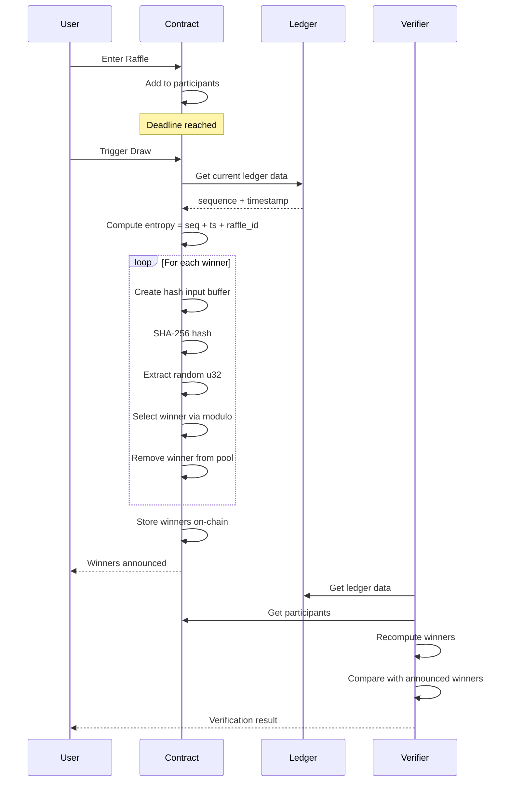
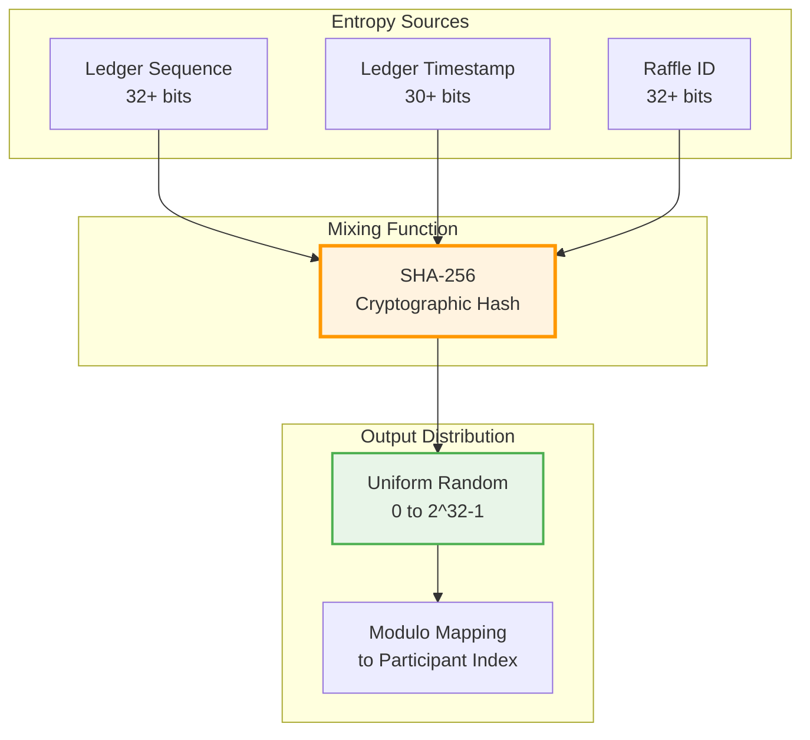
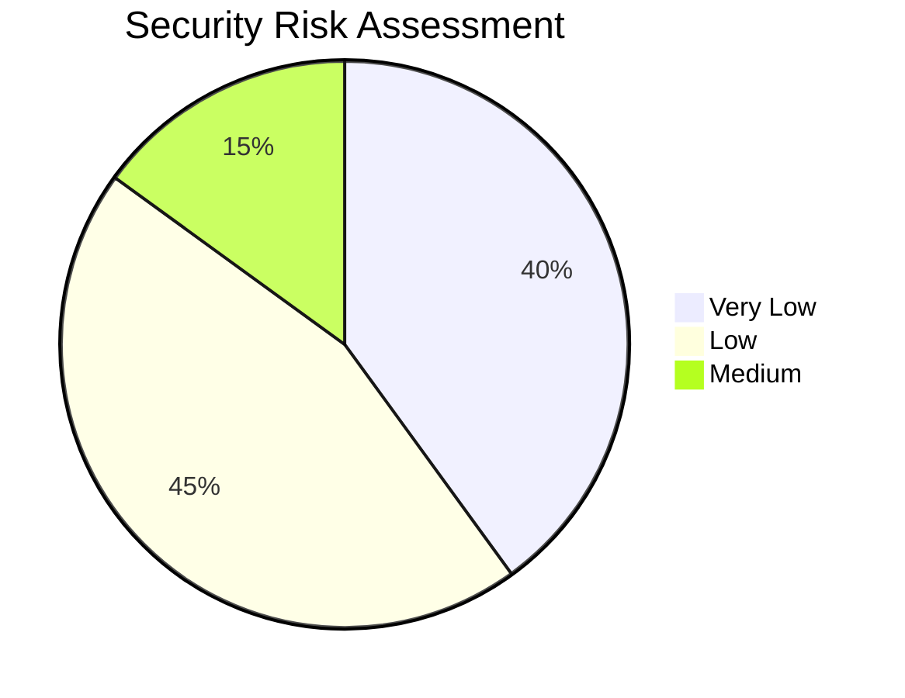
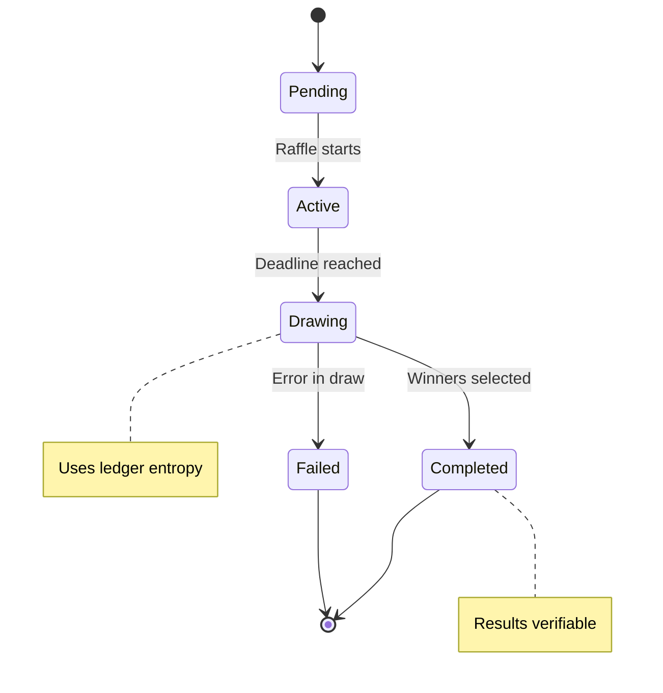

graph TD
    A[Raffle Draw Triggered] --> B[Get Current Ledger Data]
    B --> C[Ledger Sequence]
    B --> D[Ledger Timestamp]
    A --> E[Raffle ID]
    A --> F[Current Participants]

    C --> G[Combine Entropy Sources]
    D --> G
    E --> G
    F --> G

    G --> H[Create Data Buffer]
    H --> I[Pack Entropy as u64]
    H --> J[Pack Participant Count as u32]
    H --> K[Pack Raffle ID as u64]

    I --> L[SHA-256 Hash]
    J --> L
    K --> L

    L --> M[Extract First 4 Bytes]
    M --> N[Convert to u32]
    N --> O[Modulo Operation]
    F --> O[participants.length]

    O --> P[Select Winner Index]
    P --> Q[Get Winner Address]
    Q --> R[Remove from Pool]
    R --> S{More Winners Needed?}
    S -->|Yes| O
    S -->|No| T[Return Winners List]

    style A fill:#e1f5fe
    style L fill:#fff3e0
    style O fill:#f3e5f5
    style T fill:#e8f5e8
```









```mermaid
graph LR
    subgraph "User Verification"
        A[Get Raffle Data] --> B[Get Ledger Data]
        B --> C[Recompute Winners]
        C --> D[Compare Results]
    end

    subgraph "Auditor Verification"
        E[Batch Process] --> F[Automated Scripts]
        F --> G[Generate Reports]
    end

    subgraph "Integration"
        H[API Endpoints] --> I[Webhook Callbacks]
        I --> J[Database Storage]
    end

    D --> K[Display Proof]
    G --> L[Publish Audit]
    J --> M[Query Interface]

    style A fill:#e3f2fd
    style E fill:#f3e5f5
    style H fill:#e8f5e8